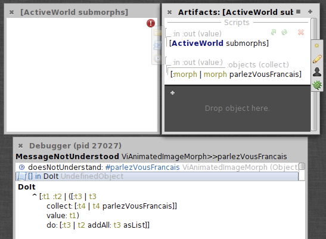

# Introduction

Let's compile `Markdown` to `PDF` via `LaTeX`^[footnotes are possible].

Referencing other literature such as [@Alexander1977] is also possible from
`Markdown.`

###### Figure: {#some-figure-key}
{width=50%}
Caption: You could also add more than one image to render them as subfigures

You can inline `LaTeX` code such as from the acronyms package: \ac{GoF}.
